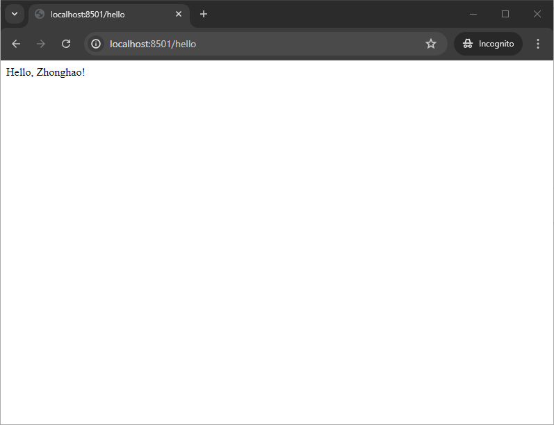

# spring-hello
Demo project for Spring Boot

This demo will include creating a simple RESTful web service.



### Step 1: Set Up Your Development Environment

1. **Install Java Development Kit (JDK):** Ensure you have JDK 11 or later installed. You can download it from [Oracle's website](https://www.oracle.com/java/technologies/javase-downloads.html).

2. **Install an IDE:** IntelliJ IDEA, Eclipse, or Visual Studio Code are popular choices for Java development.

3. **Install Maven or Gradle:** These are build automation tools used to manage dependencies and build the application. Maven is used in this example. You can download Maven from [Apache Maven](https://maven.apache.org/download.cgi).

```sh
mv tar xzvf apache-maven-3.9.8-bin.tar.gz /opt/tar xzvf apache-maven-3.9.8-bin.tar.gz
cd /opt
tar xzvf apache-maven-3.9.8-bin.tar.gz
apache-maven-3.9.8/bin/mvn -version
# Apache Maven 3.9.8 (36645f6c9b5079805ea5009217e36f2cffd34256)
# Maven home: /opt/apache-maven-3.9.8
# Java version: 1.8.0_45, vendor: Oracle Corporation
# Java home: /Library/Java/JavaVirtualMachines/jdk1.8.0_45.jdk/Contents/Home/jre
# Default locale: en_US, platform encoding: UTF-8
# OS name: "mac os x", version: "10.8.5", arch: "x86_64", family: "mac
```

### Step 2: Initialize a Spring Boot Project

1. **Spring Initializr:** The easiest way to create a Spring Boot project is by using Spring Initializr. You can access it via [start.spring.io](https://start.spring.io/).

2. **Project Setup:**
   - **Project:** Maven Project
   - **Language:** Java
   - **Spring Boot:** Latest stable version
   - **Project Metadata:**
     - Group: `com.example`
     - Artifact: `demo`
     - Name: `demo`
     - Package Name: `com.example.demo`
     - Packaging: Jar
     - Java: 11

3. **Dependencies:**
   - Spring Web (for creating web applications, including RESTful services)
   - Spring Boot DevTools (for automatic restarts and configurations in development)
   - Spring Data JPA (for database access)
   - H2 Database (in-memory database for development and testing)

### Step 3: Generate and Download the Project

- Click "Generate" to download a ZIP file containing your new project. Extract it to a suitable location on your computer and open it with your IDE.

### Step 4: Configure Application Properties

Open the `application.properties` (or `application.yml`) file located in the `src/main/resources` directory and add the necessary configurations.

```properties
# Server configuration
server.port=8080
```

### Step 5: Create a REST Controller

1. In your `src/main/java/com/example/demo` directory, create a new package called `controller`.
2. Inside the `controller` package, create a new Java class named `HelloController`.

```java
package com.example.demo.controller;

import org.springframework.web.bind.annotation.GetMapping;
import org.springframework.web.bind.annotation.RestController;

@RestController
public class HelloController {

    @GetMapping("/hello")
    public String sayHello() {
        return "Hello, Zhonghao!";
    }
}
```

### Step 6: Run the Application

Run the application from your IDE or use the command line:

```sh
mvn clean install

mvn spring-boot:run
```

### Step 7: Test the Application

- Open your web browser or a tool like Postman.
- Navigate to `http://localhost:8501/hello`.
- You should see the message "Hello, World!".

### Detailed Code Overview

#### `DemoApplication.java`

This is the entry point for the Spring Boot application.

```java
package com.example.demo;

import org.springframework.boot.SpringApplication;
import org.springframework.boot.autoconfigure.SpringBootApplication;

@SpringBootApplication
public class DemoApplication {

    public static void main(String[] args) {
        SpringApplication.run(DemoApplication.class, args);
    }
}
```

#### `HelloController.java`

This is the REST controller that handles HTTP GET requests to `/hello`.

```java
package com.example.demo.controller;

import org.springframework.web.bind.annotation.GetMapping;
import org.springframework.web.bind.annotation.RestController;

@RestController
public class HelloController {

    @GetMapping("/hello")
    public String sayHello() {
        return "Hello, Zhonghao!";
    }
}
```

### Project Structure

Your project structure should look like this:

```
demo
├── src
│   ├── main
│   │   ├── java
│   │   │   └── com
│   │   │       └── example
│   │   │           └── demo
│   │   │               ├── DemoApplication.java
│   │   │               └── controller
│   │   │                   └── HelloController.java
│   │   └── resources
│   │       ├── application.properties
│   │       └── static
│   │       └── templates
│   └── test
│       └── java
│           └── com
│               └── example
│                   └── demo
│                       └── DemoApplicationTests.java
├── mvnw
├── mvnw.cmd
├── pom.xml
└── README.md
```
